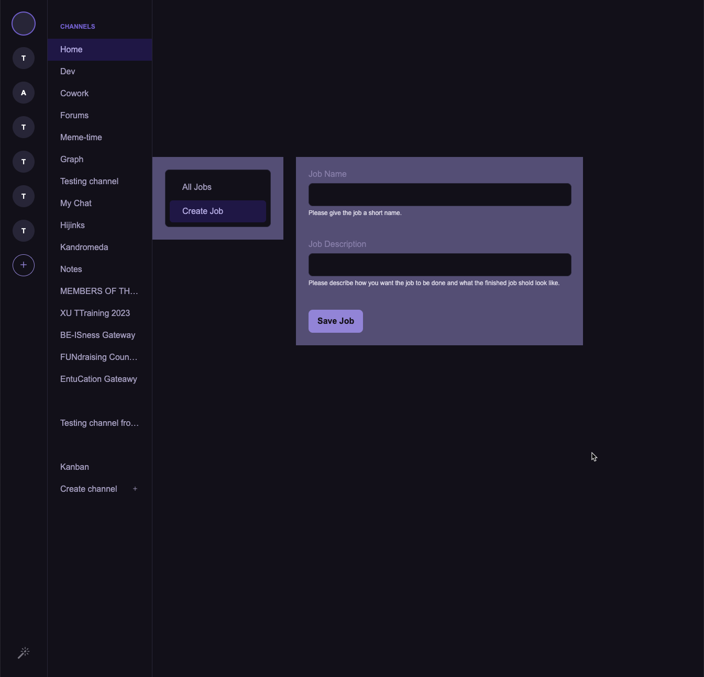
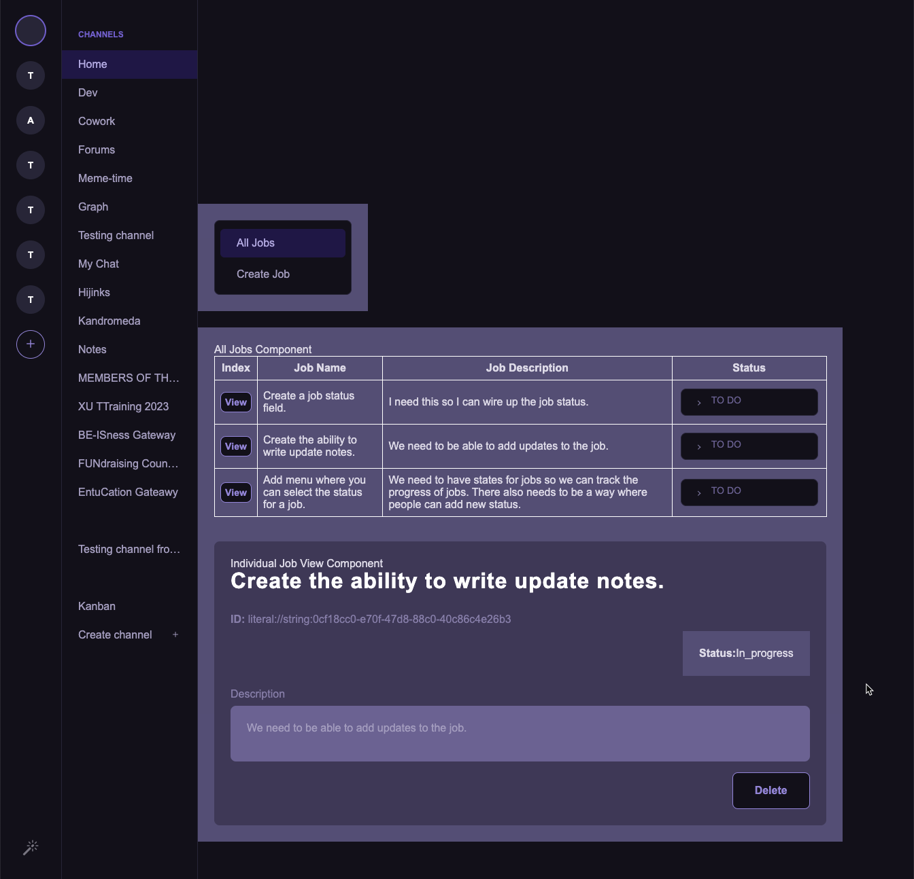

# Introducing Collaborative Tasks

Collaborative Tasks is a Flux Social plugin designed to streamline shared task management within a peer-to-peer framework.

Features:

[x] Create, view, and delete shared tasks.

[x] Real-time task status tracking.


Upcoming enhancements include:
[] - status updates, 
[] - time entry integration, 
[] - progress updates, 
[] - invoicing generation, 
[] - time log sharing, and 
[] - image attachments for task documentation.


todo: FluxSocial Deep Link here to see live job board of each project.


Simplify collaborative task coordination with Collaborative Tasks, an essential tool for effective teamwork within Flux Social's ecosystem.


# Create Flux Plugin

Bootstrap a new [Flux](https://fluxsocial.io) plugin for your community.

[Documentation](https://docs.fluxsocial.io/create-flux-plugin/getting-started/introduction.html)

Install deps and start building:

```bash [npm]
cd [plugin-name]
npm install
npm run dev
```

## Prerequisites

Flux runs on top of [AD4M](https://ad4m.dev), a p2p framework where all data is stored and shared. In order to build a new Flux app you need to [download](https://ad4m.dev/download) and install AD4M.
